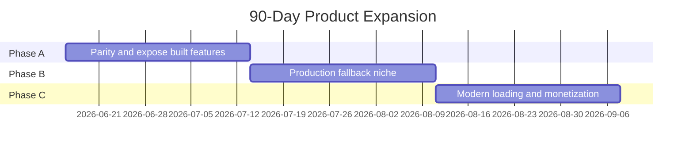
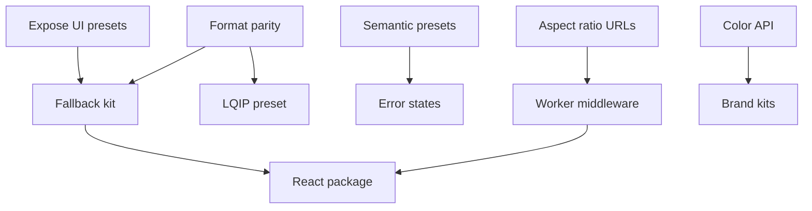

# Implementation Plan: Product Expansion Roadmap

**Program**: `031-product-expansion-roadmap` | **Date**: 2026-06-15 | **Horizon**: 90 days

**Input**: Market research and competitive gap analysis (conversation 2026-06-15)

## Summary

Execute a three-phase program to strengthen fallback.pics as the **deterministic production image-fallback layer** — not a Picsum clone or AI mockup studio. Phase A closes competitive parity gaps and exposes existing API depth. Phase B owns the production-fallback niche with semantic presets and framework integration. Phase C adds modern loading primitives and monetization-ready enterprise features.

**Positioning anchor**: *When CDN, seller, or user images fail, layouts stay stable, URLs stay cacheable, and teams ship without storing placeholder assets.*

## Technical Context

**Language/Version**: TypeScript 5.x, Astro 4, React 18, Cloudflare Workers, pnpm monorepo

**Primary Dependencies**: Astro, React islands, Tailwind CSS, Cloudflare Workers raster encoder (`apps/worker/src/raster.ts`; PNG/JPEG/WebP currently, AVIF TBD)

**Storage**: N/A for core features; optional D1/KV later for brand kits and analytics (Phase C)

**Testing**: Worker Vitest (`apps/worker`), Astro build, router/generator tests, curl contract checks, Playwright visual QA for generator UI

**Target Platform**: Cloudflare Pages (`apps/web`) + Cloudflare Workers (`apps/worker`) at `/api/v1/...`

**Performance Goals**: SVG-first responses &lt;50ms edge; immutable cache headers preserved; raster formats only when explicitly requested

**Constraints**:
- Public URLs must remain truthful (`/api/v1/...` strategy)
- Deterministic output for same URL (except explicitly documented random modes)
- No PII logging from `text=` query params by default
- AVIF/GIF require raster pipeline validation before ship

**Scale/Scope**: Worker routing/generators, web generators (`LiveDemoEnhanced`, `EnterpriseLanding`), docs/API reference, SEO pages, optional npm package

## Constitution Check

| Principle | Phase A | Phase B | Phase C |
|-----------|---------|---------|---------|
| Public URL truth | New routes documented in contracts | Semantic presets get SEO pages | Hash/color JSON endpoints documented |
| Edge-first delivery | AVIF via existing raster path | Worker middleware template | BlurHash decode stays client-side |
| Testable behavior | Router + format tests per epic | Integration snippet tests | Analytics privacy tests |
| Docs/SEO consistency | API reference + generator parity | Platform guides (Next, Workers) | Pro tier docs |
| Privacy/security | No new tracking in A | Signed URLs optional in C | Analytics excludes query text |

## Program Structure

### Documentation (this program)

```text
specs/031-product-expansion-roadmap/
├── plan.md              # This file
├── tasks.md             # Cross-phase task backlog
├── epics.md             # Epic definitions and acceptance criteria
└── research-summary.md  # Condensed market inputs
```

### Source Code (by area)

```text
apps/worker/src/
├── index.ts             # Route dispatch
├── router.ts            # URL parsing
├── generator.ts         # SVG generation
├── raster.ts            # PNG/JPEG/WebP encoding; AVIF parity work TBD
├── thumbnail-generator.ts
├── chart-generator.ts
└── animated-generator.ts

apps/web/src/
├── components/LiveDemoEnhanced.tsx
├── components/EnterpriseLanding.tsx
├── pages/docs.astro
└── data/seoPages.ts

packages/shared/         # Future: preset constants, snippet types
```

## Phase Overview



---

## Phase A — Parity & Expose (Weeks 1–4)

**Goal**: Close table-stakes gaps vs placehold.co/ImageNow and surface API features already built but hidden in UI.

### Epic A1: Generator UI parity
**Priority**: P0 | **Effort**: M | **Owner**: web

Expose in `LiveDemoEnhanced` and `EnterpriseLanding`:
- Chart preset + chart type picker (8 types)
- Existing gradient route
- Thumbnail style picker (soft, rings, lines, pattern) — theme picker already exists on homepage

**Acceptance**:
- Generator-visible capabilities match current API inventory: standard, square, avatar, banner, thumbnail, skeleton, blur, animated, pattern/AI, chart, and gradient
- Random/pattern language is honest; no UI implies Unsplash or remote photos
- Preview updates live for each sub-option

**Spin-off spec**: `032-expose-hidden-generator-presets`

### Epic A2: Format & URL parity
**Priority**: P0 | **Effort**: M | **Owner**: worker

| Feature | Implementation |
|---------|----------------|
| AVIF output | Enable in `raster.ts` + router validation (currently rejected) |
| GIF output | Keep rejected in v1 with an actionable 400 message; revisit static GIF only if demand is proven |
| `@2x` / `@3x` in path | Parse `400x300@2x` in `router.ts`; alias existing `?retina=` |
| Transparent background | Already supported; add/verify docs and regression tests |
| CSS color names | Already supported in `normalizeColor`; add/verify docs and regression tests |

**Acceptance**:
- `curl` tests for AVIF, unsupported GIF, DPR variants, transparent background, and CSS color names
- Generator shows format selector for supported formats (svg default; include AVIF only when Worker support is enabled)

**Spin-off spec**: `033-format-and-dpr-parity`

### Epic A3: Named semantic presets
**Priority**: P0 | **Effort**: S | **Owner**: worker + web

Add keyword routes (dimensions fixed, overridable via query only if documented):

| Keyword | Dimensions | Default use |
|---------|------------|-------------|
| `og` | 1200×630 | Open Graph |
| `product` | 800×800 | E-commerce tile |
| `hero` | 1920×1080 | Landing hero |
| `email` | 600×400 | Email clients (default jpeg) |
| `story` | 1080×1920 | Vertical social |
| `ad/300x250` | IAB sizes | Display ads |

URL shape: `/api/v1/preset/og` or `/api/v1/og` (pick one; document in contract).

**Acceptance**:
- Generator quick-pick chips for top 6 presets
- SEO page per high-intent preset keyword

**Spin-off spec**: `034-semantic-size-presets`

### Epic A4: Fallback kit export
**Priority**: P0 | **Effort**: M | **Owner**: web

Generator exports copyable bundles:
- HTML `` with `width`, `height`, `aspect-ratio`, `loading`, `decoding`, `alt`
- `onerror` one-liner swapping to generated fallback URL
- React, Next.js `<Image>`, CSS `background-image`, curl

**Acceptance**:
- Tab UI matches existing code tabs on homepage
- Snippets use actual generated URL and dimensions

**Spin-off spec**: `035-fallback-kit-export`

### Phase A exit criteria
- [ ] Generator exposes chart, gradient, full thumbnail controls
- [ ] AVIF + `@2x` documented and tested; transparent/CSS color behavior covered by docs/tests
- [ ] 6 semantic presets live in API + generator chips
- [ ] Fallback kit tab ships on both generators
- [ ] API reference and llms.txt updated

---

## Phase B — Production Fallback Niche (Weeks 5–8)

**Goal**: Own the "broken image + layout reservation" workflow for real production stacks.

### Epic B1: Aspect-ratio URL syntax
**Priority**: P1 | **Effort**: M | **Owner**: worker

Support:
- `/api/v1/800x16:9` → height = round(800 * 9/16)
- `/api/v1/4:3x600` → width = round(600 * 4/3)

Reuse ratio parser; validate min/max dimensions after calculation.

**Spin-off spec**: `036-aspect-ratio-urls`

### Epic B2: State-specific presets
**Priority**: P1 | **Effort**: M | **Owner**: worker

New preset family or query `?state=`:

| State | Visual | Default label |
|-------|--------|---------------|
| `unavailable` | Muted + icon | Image unavailable |
| `processing` | Skeleton | Loading… |
| `restricted` | Blur + lock | Restricted |
| `deleted` | Flat gray | Removed |
| `offline` | Dashed border | Offline |

Deterministic SVG; same URL → same output.

**Spin-off spec**: `037-error-state-presets`

### Epic B3: Cloudflare Worker middleware template
**Priority**: P1 | **Effort**: M | **Owner**: worker + docs

Ship `examples/worker-image-fallback/`:
- Fetch upstream image → on 404/5xx → redirect or proxy fallback.pics URL
- Preserve requested dimensions in fallback URL
- README + docs page + blog cross-link

**Acceptance**:
- Deployable wrangler example
- Documented in `/docs/` and API reference

**Spin-off spec**: `038-worker-fallback-middleware`

### Epic B4: Framework integration package
**Priority**: P1 | **Effort**: L | **Owner**: packages + web

**MVP**: `packages/fallback-react` or documented copy-paste module:
- `<FallbackImage src={} preset="product" />`
- `useImageFallback()` hook
- Next.js App Router example

**Defer**: WordPress/WooCommerce plugins to Phase B+ (separate specs per platform).

**Spin-off spec**: `039-react-fallback-component`

### Epic B5: Accessibility & motion
**Priority**: P2 | **Effort**: S | **Owner**: worker + web

- WCAG contrast warning in generator when fg/bg fails AA
- `prefers-reduced-motion`: animated routes serve static first frame
- Snippet export includes `alt` and `aria` guidance

**Spin-off spec**: `040-a11y-generator-warnings`

### Phase B exit criteria
- [ ] Aspect-ratio URLs in router tests
- [ ] 5 error-state presets documented
- [ ] Worker example repo path works with wrangler dev
- [ ] React fallback component published (npm or monorepo package)
- [ ] Reduced-motion respected on animated preset

---

## Phase C — Modern Loading & Monetization (Weeks 9–12)

**Goal**: Add hash/color primitives, brand kits, and Pro-tier foundations without breaking free tier.

### Epic C1: Dominant color & swatch API
**Priority**: P1 | **Effort**: M | **Owner**: worker

Endpoints:
- `GET /api/v1/color/{hex}` → 1×1 PNG or `application/json` with `{ hex, rgb }`
- `GET /api/v1/swatches?seed={id}` → `{ bg, fg, accent }` deterministic from seed

**Use case**: CLS-friendly container `background-color` without image request.

**Spin-off spec**: `041-dominant-color-api`

### Epic C2: BlurHash / ThumbHash endpoint (read-only generate)
**Priority**: P2 | **Effort**: L | **Owner**: worker

- `GET /api/v1/blurhash/{w}x{h}/{bg}/{fg}` → JSON `{ hash, width, height }`
- Client decode snippet in docs (use existing JS libraries)
- **Do not** accept arbitrary remote image URLs in v1 (abuse risk)

**Spin-off spec**: `042-blurhash-endpoint`

### Epic C3: LQIP micro-image preset
**Priority**: P2 | **Effort**: M | **Owner**: worker

- `/api/v1/lqip/{w}x{h}/...` → tiny WebP/JPEG (~24px wide), heavily blurred
- Document pairing with `srcset` and `onerror`

**Spin-off spec**: `043-lqip-preset`

### Epic C4: Brand kits (Pro)
**Priority**: P2 | **Effort**: L | **Owner**: worker + future dashboard

URL shape: `/api/v1/brand/{slug}/avatar/128?text=JD`

v1: Config in `wrangler.toml` / KV per deployment; no self-serve UI required for MVP.

**Spin-off spec**: `044-brand-kits-pro`

### Epic C5: Custom domain & privacy-safe analytics
**Priority**: P2 | **Effort**: L | **Owner**: infra

- Custom domain docs + Cloudflare for SaaS pattern
- Analytics: preset, dimensions, format, status — **exclude** `text`, `context`, `mood` query values
- Rate limiting tiers (free 1000/day per IP per existing roadmap)

**Spin-off spec**: `045-pro-analytics-custom-domain`

### Phase C exit criteria
- [ ] Color/swatch JSON endpoints tested
- [ ] BlurHash JSON returns stable hash for same URL
- [ ] LQIP preset documented with HTML example
- [ ] Brand kit slug routing works in staging
- [ ] Analytics schema documented with privacy guarantees

---

## Explicitly Deferred (Out of 90-Day Scope)

| Item | Reason | Revisit when |
|------|--------|--------------|
| Unsplash/random photos | Non-deterministic, legal/ops cost | Optional `?mock=photo&seed=` as separate product |
| AI product mockups | Different buyer (merchants vs devs) | Never core; partner links only |
| Full imgix/Cloudinary transforms | Wrong category | N/A |
| WordPress/Shopify plugins | High support burden | After React package traction |
| Video poster presets | Nice-to-have | Phase D |
| QR/barcode placeholders | SEO traffic play | Phase D if bandwidth |

---

## Dependency Graph



**Critical path**: A1 → A4 → B3 → B4 (developer adoption), with A2 unblocking modern-format parity and C3 LQIP.

---

## Success Metrics

| Metric | Baseline | Phase A | Phase B | Phase C |
|--------|----------|---------|---------|---------|
| Generator preset coverage | core UI lags API | UI matches current API inventory | +error states | +hash/color |
| API reference completeness | partial | 100% routed presets | +middleware | +JSON endpoints |
| Organic landing pages | existing SEO | +6 preset pages | +Workers guide | +Pro page |
| Copy-to-clipboard events | track | +fallback kit usage | +npm downloads | — |
| Worker p95 latency | measure | no regression | no regression | JSON routes &lt;100ms |

---

## Risk Register

| Risk | Impact | Mitigation |
|------|--------|------------|
| AVIF encoding slow on Workers | High | Benchmark `raster.ts`; cache aggressively; SVG default |
| Generator UI overcrowding | Medium | Group presets: Basic / Media / Loading / Advanced |
| Semantic preset URL collisions | Medium | Namespace under `/preset/` if needed |
| BlurHash bundle size in Worker | Medium | WASM only if needed; precompute simple hashes |
| Scope creep into photo APIs | High | Defer list in plan; require spec per epic |
| Free tier abuse at scale | Medium | Rate limits before Pro launch |

---

## Spec Kit Spin-Off Index

Each epic should become its own numbered spec before implementation:

| ID | Epic | Priority |
|----|------|----------|
| 032 | Expose hidden generator presets | P0 |
| 033 | Format and DPR parity | P0 |
| 034 | Semantic size presets | P0 |
| 035 | Fallback kit export | P0 |
| 036 | Aspect-ratio URLs | P1 |
| 037 | Error-state presets | P1 |
| 038 | Worker fallback middleware | P1 |
| 039 | React fallback component | P1 |
| 040 | A11y generator warnings | P2 |
| 041 | Dominant color API | P1 |
| 042 | BlurHash endpoint | P2 |
| 043 | LQIP preset | P2 |
| 044 | Brand kits Pro | P2 |
| 045 | Pro analytics + custom domain | P2 |

**Recommended first sprint**: 032 → 035 → 034 → 033 (visible UI value, adoption snippets, semantic URLs, then format parity)

---

## Complexity Tracking

| Violation | Why Needed | Simpler Alternative Rejected Because |
|-----------|------------|-------------------------------------|
| AVIF raster on edge | Market parity with placehold.co | SVG-only fails email/modern format expectations |
| JSON endpoints (hash/color) | Modern loading stack | URL-only images cannot serve 7-byte dominant color |
| Brand kits in KV | Pro monetization | Hard-coded wrangler config does not scale for customers |
